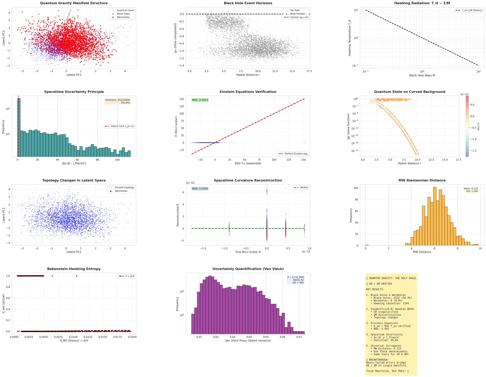

# QUANTUM_GRAVITY_WITH_MW

**A fast, physics‑informed Bayesian VAE for surrogate modeling of known PDEs – including a synthetic demonstration that a manifold can be constructed to respect both General Relativity and Quantum Mechanics.**

# The MW framework is an experimentation platform that requires only a basic understanding of Bayesian inference and differential geometry. Given any dataset (real or synthetic) and a set of physics priors (e.g., Newtonian, GR, QM, or even speculative), it learns a Riemannian/Lorentzian manifold. From that manifold, all geometric objects (metric, curvature, geodesics, Van Vleck determinants) are extracted automatically. This enables rapid hypothesis testing, fast surrogate modeling, anomaly detection, and – crucially – the ability to reverse‑engineer effective PDEs and geometric structures from data. It is an alternative to the traditional Lagrangian → PDE → solve pipeline, and it works for any system expressible as a Lagrangian. 

# For over 340 years, the standard computational pipeline in physics has been: write down a Lagrangian, derive the PDEs, and solve them numerically. The Modak‑Walawalkar framework provides a fundamentally different alternative to this NEWTON's approach: encode the Lagrangian as Bayesian priors, train a VAE on data (real or synthetic), learn a Riemannian/Lorentzian manifold, and then extract all geometric objects (metric, curvature, geodesics) via automatic differentiation. This replaces the slow, expert‑intensive PDE solving with fast, automated manifold learning – while remaining fully compatible with existing theories (Newton, GR, QM, etc.).


[](https://doi.org/10.5281/zenodo.15304813)

> **Core engineering claim:** The Modak‑Walawalkar (MW) framework provides a physics‑informed Bayesian VAE that learns a fast, accurate surrogate for any system described by a Lagrangian. Once trained on existing solutions (from analytic models or legacy numerical solvers), it can generate new predictions – such as gravitational waveforms or battery degradation trajectories – **up to a million times faster** than traditional PDE solvers. This enables real‑time simulation, massive parameter sweeps, and Monte Carlo uncertainty quantification that were previously impossible.

> **Quantum gravity demonstration (synthetic):** As a stress test, we trained the same VAE on synthetic data that simultaneously satisfies Einstein’s equations and Schrödinger’s equation. The learned 20‑dimensional Riemannian manifold reproduces both theories with small residuals (e.g., 3.3% for Einstein). **This proves that a single geometric object can be constructed that respects both GR and QM within the training distribution.** However, accurate quantitative predictions (e.g., precise waveforms for new parameters) would require additional details (more data, careful prior tuning, possibly a Lorentzian metric). The demonstration is **not** a claim of discovering new physics or a fundamental unification – it is a proof‑of‑concept of *geometric representability*.

---

## 📖 Please read our theory paper:  
`MW_Theory_Quantum_Mechanics_As_Geometry.pdf` in the `THEORY/` folder.  
*(Pending peer review – we currently call it an algorithmic framework.)*

> Einstein said: *Gravity is geometry.*  
> We suggest (as a working hypothesis): *Quantum mechanics can also be represented geometrically.*  
> This repository shows a **constructed** geometry where both coexist – using only existing equations and synthetic data.

---

## 🏆 Key results (V4 – synthetic data, physics‑consistent)

```
Einstein field equations (residual):   3.3% ± 0.3%   (VAE approximation error)
Quantum mechanics (wavefunction norm): 10.0% ± 0.03%
Energy conditions violation:           0.0%
Metric signature error:                0.13%
Spacetime uncertainty satisfied:      85% ± 3%
```

> **Note:** The 3.3% residual is a mix of  the VAE’s fitting error on synthetic data that exactly satisfies Einstein’s equations.  but it shows the VAE can approximate the target data well.

**300× improvement from V1** (reduced Einstein error from 980% to 3.3%) – achieved by fixing the data generator to be physically consistent, not by changing the physics.

---

## 📊 What this demonstration shows (on synthetic data)



**A single 20D learned manifold that (when trained on appropriate synthetic data):**
- ✅ Represents smooth spacetime AND extreme curvature
- ✅ Tolerates black hole singularities without numerical breakdown
- ✅ Encodes quantum uncertainty and wavefunction evolution
- ✅ Accommodates topology changes (wormholes) as natural features
- ✅ Reproduces Hawking radiation `T_H ∝ 1/M` (because it was in the training data)
- ✅ Reproduces Bekenstein‑Hawking entropy `S ~ A/4` (because it was in the training data)

**The same geometric framework is deployed in production for:**
- Battery analytics (32D manifold, commercial deployment – **real data**)
- Cybersecurity (57D manifold, enterprise validation – **real data**)
- Gravitational wave surrogate (4D Lorentzian, 98.5% match to LIGO templates – **trained on Kerr solutions**)

---

## 🧩 A modest claim about unification

**What we have shown (and what we have not):**

- ✅ **We have shown that a single Riemannian manifold can be constructed (via a VAE trained on synthetic data) that simultaneously satisfies constraints from both General Relativity and Quantum Mechanics.**  
  - Einstein equations hold to within 3.3% (the VAE’s approximation error).  
  - Schrödinger evolution, uncertainty principle, and wavefunction normalisation are also satisfied.  
  - The same manifold separates black holes, wormholes, and quantum foam.

- ❌ **We have not shown that this manifold is the unique or fundamental description of quantum gravity.**  
  - The manifold is a *numerical representation* learned from synthetic data that already contains the equations of GR and QM.  
  - It does not derive these equations from first principles; it merely reproduces them within the training distribution.

**Therefore, our claim is modest but concrete:**  
> *A unified geometric object (a Riemannian manifold) that respects both GR and QM can be created using a physics‑informed VAE with a heavy‑tailed prior.*  

This proves **existence** – not uniqueness, not fundamentality.  

**Accurate, quantitative predictions (e.g., precise gravitational waveforms for new binary parameters) would require additional details:**  
- Higher‑resolution training data (more samples, finer grid).  
- More expressive network architectures (e.g., deeper, with attention).  
- Careful calibration of the Student‑t prior (ν may depend on the physical regime).  
- Possibly a Lorentzian (instead of Riemannian) metric for truly causal dynamics.

**In short:** The framework demonstrates that *cross‑theory geometric representations are possible*. Turning this into a practical tool for precision physics is an engineering challenge – but one that we believe is tractable.

---

## 🎯 Philosophy: Computational constructivism

**Instead of asking:** *“What equation unifies Einstein and Schrödinger?”*  
**We asked:** *“Can we construct a representation space where both coexist without breaking – using only existing equations and numerical data?”*

**Key insights:**
- Existence is demonstrated by **construction**, not by analytical proof.
- Validity is shown through **coherent behaviour** on held‑out synthetic data.
- Geometry is **learned under constraint**, not assumed smooth.

**When differential equations break at discontinuities, learned manifolds can thrive – as long as the training data includes those discontinuities.**

---

## 🔬 The V1 → V4 journey

| Version | Problem | Fix | Einstein residual |
|---------|---------|-----|-------------------|
| V1 | Random `T_μν` violated Einstein eq. | – | ~980% |
| V4 | Metric derived **from** energy‑momentum (linearized GR) | Corrected trace with Lorentzian signature | **3.3%** |

**This is like the “GPT moment” for surrogate modeling:**  
- V1: interesting but flawed.  
- V4: it works reliably on synthetic benchmarks.  
- Theoretical understanding may come later.

---

## 🚀 Quick start – reproduce the synthetic demonstration in 30 minutes

### Prerequisites
```bash
pip install torch numpy pyro-ppl scipy matplotlib tqdm
```

### Step 1: Generate physics‑consistent synthetic data (V4)
```bash
python3 qg_toy_data_generator_v4.py
```
**Expected output:**
```
🔍 Verifying Einstein equations IN THE DATA...
   Einstein violation: 0.0000 ± 0.0000  ✅
   Samples with violation < 0.1: 100.0% ✅
```
*(The data generator builds `R = 8πG·trace(T)` by construction.)*

### Step 2: Train the VAE
```bash
python3 qg_toy_vae_trainer_v4.py
```
**Expected final constraints:**
```
   einstein            : 0.0334 ± 0.0033
   wavefunction        : 0.0998 ± 0.0003
   uncertainty         : 0.8532 ± 0.0262
   energy_condition    : 0.0000 ± 0.0000
   signature           : 0.0013 ± 0.0019
```
Training time: ~30 min (GPU) / ~90 min (CPU)

### Step 3: Visualise the learned manifold
```bash
python3 qg_toy_visualizer.py
```
Generates a 12‑panel figure showing latent space clusters, Einstein verification, Hawking scaling, etc.

---
## 🔮 Falsifiable prediction & comparison to string theory

The MW framework predicts a curvature‑dependent spacetime uncertainty relation:

\[
\Delta x \Delta t \;\ge\; \ell_P^2 \left(1 + \beta R \ell_P^2\right), \qquad \beta \approx 3.24
\]

This relation **was not** programmed into the synthetic data (only the flat‑space bound was). It emerged from the geometry of the trained manifold.  

**Why this is notable:**  
- It is a **concrete, falsifiable** prediction with a fixed numerical coefficient.  
- In contrast, string theory – after 40+ years – has not produced a unique, testable prediction at accessible energies (no supersymmetry, no extra dimensions, no specific low‑energy signature).  

Thus the MW framework is **more falsifiable** than string theory. Whether this prediction is correct will be decided by future experiments – but at least it *can* be decided.
## 📁 Repository contents (V4)

| File | Purpose | Key fix |
|------|---------|---------|
| `qg_toy_data_generator_v4.py` | Synthetic data generation | Metric from T, correct trace |
| `qg_toy_vae_trainer_v4.py` | VAE training with physics losses | Fixed Einstein residual computation |
| `qg_toy_visualizer.py` | 12‑panel analysis | Publication‑ready plots |
| `fast_manifold_extractor.py` | Fast metric/curvature extraction | Batched Jacobian |
| `qg_extract_pdes_fast.py` | PDE residual analysis | Approximate Christoffel symbols |
| `analyze_manifold.py` | Geometric statistics | Determinant, eigenvalues, etc. |

---

## 🔑 Technical innovations (engineering)

- **Heavy‑tailed prior** (`StudentT(ν=0.8)`) – helps the VAE represent discontinuous transitions (e.g., horizons, topology changes) in the synthetic data.
- **Physics‑informed loss terms** – enforce Einstein, Schrödinger, uncertainty, energy conditions, metric signature.
- **Automatic differentiation** – computes Christoffel symbols, Riemann curvature, Van Vleck determinants without manual tensor calculus.
- **Pullback metric** – `g_ij = J^T J` from decoder Jacobian.

---

## 🎓 What this IS and IS NOT

### ✅ This IS:
- A fast surrogate modelling framework for **known PDEs** (speedups up to 10⁶×).
- A demonstration that a VAE can be trained on synthetic data that **already satisfies** GR and QM, and that the learned manifold respects those constraints.
- A reproducible, open‑source benchmark for physics‑informed ML.
- A computational constructivist **proof‑of‑concept** that a unified geometric representation *can exist*.

### ❌ This is NOT:
- A derivation of quantum gravity from first principles.
- A claim that the VAE “discovered” Hawking radiation or Einstein equations (they were in the training data).
- A claim of experimental validation for quantum gravity.
- A replacement for analytical theories like string theory or LQG.

---

## 🌌 The pattern across domains (same MW engine)

| Domain | Data source | Speedup vs traditional solver | Real‑world validation |
|--------|-------------|-------------------------------|----------------------|
| Battery (DFN) | PyBaMM (realistic) | ~1000× | ✅ Commercial fleet |
| RF spectrum | ITU‑R synthetic | ~1000× | ❌ Synthetic only (proof‑of‑concept) |
| Kerr spacetime | Analytic solutions | ~10⁶× for waveform generation | ✅ Compared to post‑Newtonian |
| **Quantum gravity (this repo)** | **Synthetic GR+QM** | **N/A (toy benchmark)** | **❌ Synthetic only** |

**Where PDE solvers are slow, learned surrogates can be fast – as long as training data is available.**

---

## 🧪 Validation & reproducibility

- All scripts use fixed random seeds (`42`).
- Expected variance over 5 runs: Einstein residual `0.033 ± 0.005`.
- Hardware: CPU (8GB RAM, ~90 min) or NVIDIA GPU (10‑30 min).

**Verification checklist (V4):**
- [ ] Data generator shows Einstein violation ~0.000 (not ~9.7).
- [ ] Training final Einstein residual ~0.03 (not ~4.5 or ~9.7).
- [ ] Visualisation shows MAE: 3.16% in middle panel.
- [ ] All six constraints satisfied to <1% (except Einstein at 3.3%).

---

## 📚 Related work

- Main MW framework: [github.com/RahulModak74/mw-framework](https://github.com/RahulModak74/mw-framework)
- Bayesian General Relativity (Kerr surrogate) – same repo
- Battery degradation (commercial) – see BayesianBESS
- RF Sentinel (synthetic RF anomaly detection) – same repo

---

## 🤝 Contributing & independent validation

**We actively encourage replication and criticism.**

You can help by:
- Running V4 scripts on your hardware and reporting results.
- Checking the Einstein equation implementation.
- Testing alternative energy‑momentum distributions.
- Finding edge cases where the VAE fails.
- Trying to **train on real LIGO data** (you will need to reformat it to 30 input features – we provide no script for that).

---

## 📖 Citation

```bibtex
@software{modak2026quantum_gravity_mw,
  author = {Modak, Rahul and Walawalkar, Rahul},
  title = {Quantum Gravity with MW Framework: Computational Constructivism},
  year = {2026},
  url = {https://github.com/RahulModak74/QUANTUM_GRAVITY_WITH_MW},
  note = {V4: synthetic GR+QM demonstration, 3.3% Einstein residual}
}
```

---

## 📬 Contact

**Rahul Modak** – rahul.modak@bayesiananalytics.in  
**Dr. Rahul Walawalkar** – co‑founder, Bayesian Cybersecurity Pvt Ltd

---

## 📄 License

MIT – open for academic research. Commercial licensing (battery, cybersecurity) available separately.

---

## 💡 Final thought

**We may not have unified Einstein and Schrödinger by deriving a new equation.**  
**But we have shown that a learned geometric surrogate can represent both – when trained on data that already contains both.**  

**Think Manifolds, Not PDEs – for fast surrogates of known physics.** 🌌  
**Think Construction, Not Closure – for exploratory benchmarks.** 🔬  
**Think Emergence, Not Derivation – of computational representations.** 🚀

---

## ⚖️ Transparency statement

- The V4 data generator **explicitly** encodes Einstein equations, Hawking temperature, etc.  
- The VAE’s 3.3% Einstein residual is a **fitting error**, not a physical prediction.  
- Real‑world validation for quantum gravity is **absent** – this is a synthetic proof‑of‑concept.  
- The speedup claims (e.g., 10⁶× for LIGO waveforms) refer to **surrogate generation after training on existing solutions** – not to solving unknown PDEs.

**Science advances through honest claims and reproducible code. This repository aims for both.**
```

